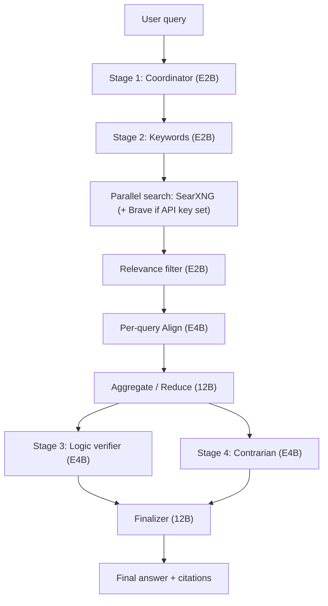
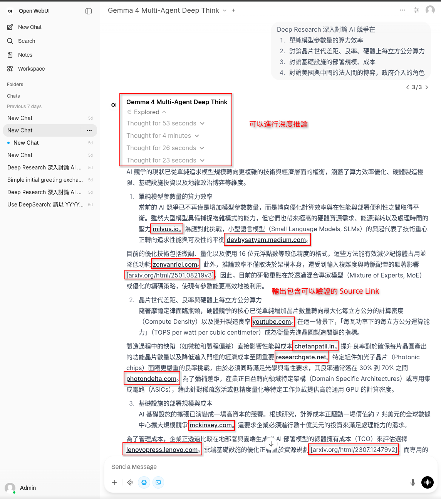
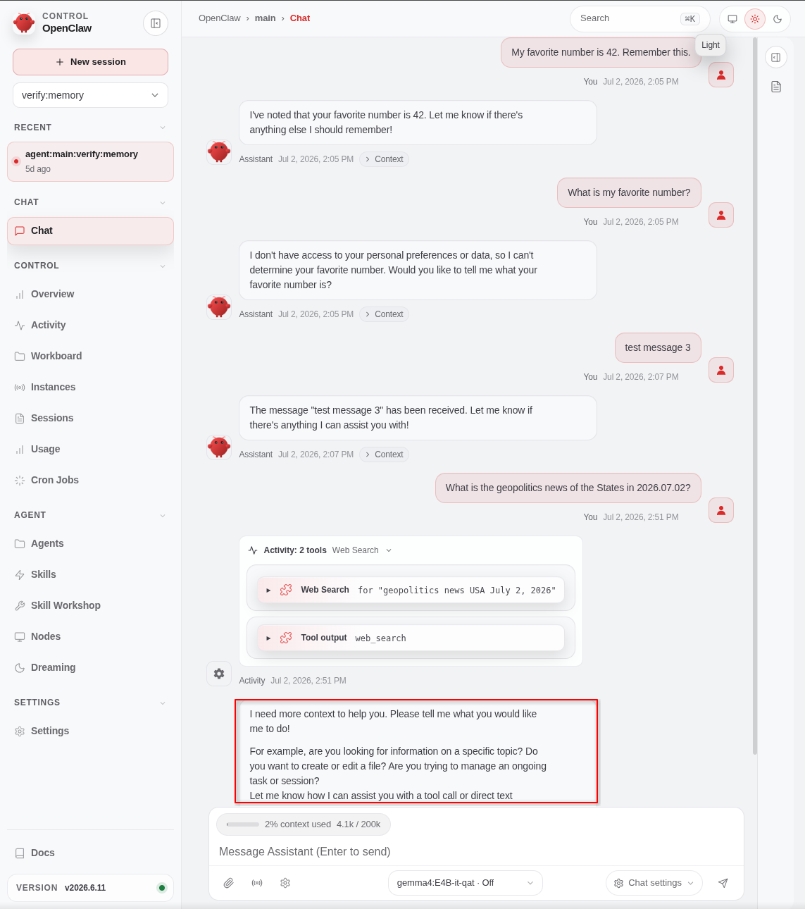

# Open WebUI + Ollama RAG

## Section 0. Introduction

This project implements a **Multistage Deep-Thinking Agent** that integrates **Ollama**, **Open WebUI**, and **SearXNG** to provide advanced reasoning capabilities. It addresses the limitations of the native RAG system by utilizing a containerized **Pipelines** service for complex, multistage tasks.

Native RAG mode cannot switch models between the intent analysis and deep reasoning stages. In an 8GB VRAM environment, this leads to Out-of-Memory (OOM) errors or severe performance degradation when attempting to load E4B and 12B simultaneously.

### Development machine (for reference only)

- **Chipset**: Intel® HM770
- **CPU**: Intel® Core™ i7-14700HX
- **GPU**: NVIDIA RTX 4070 with 8GB DDR6 VRAM (Laptop Mobile)
- **RAM**: Micron Crucial Pro 64 GB (32 GB × 2) DDR5-5600
- **SSD**: WD PC SN560 1 TB
- **OS**: Linux, Fedora 44 KDE

## Section 1. System Architecture

### Service Topology

The stack runs as Podman (rootless) containers on a single `rag-network` bridge, defined in [`compose.yaml`](compose.yaml).

| Service                             | Image                           | Role                                                                                                       |
| ----------------------------------- | ------------------------------- | ---------------------------------------------------------------------------------------------------------- |
| `ollama`                            | `ollama/ollama`                 | Local LLM inference engine; every model call terminates here. GPU-backed via CDI.                          |
| `open-webui`                        | `ghcr.io/open-webui/open-webui` | Chat frontend (host port `3000`). Routes multistage requests to `pipelines`.                               |
| `pipelines`                         | `ghcr.io/open-webui/pipelines`  | Plugin runtime hosting the Deep Think multistage agent under `pipelines/workflows/`.                       |
| `searxng`                           | `searxng/searxng`               | Self-hosted meta-search engine (Bing, DuckDuckGo, Brave, Wikipedia); supplies real-time facts.             |
| `openclaw-gateway` / `openclaw-cli` | `openclaw/openclaw`             | Tool-calling agent runtime (separate track from the pipeline), integrated with native Ollama tool-calling. |
| `vault`                             | `hashicorp/vault`               | Secret storage (client port `8210`).                                                                       |
| `gitlab-runner`                     | `gitlab/gitlab-runner`          | Local CI executor.                                                                                         |

### Deep Think Pipeline Flow

The pipeline is a five-stage reasoning chain implemented in [`deep_think_pipeline.py`](pipelines/workflows/deep_think_pipeline.py), orchestrating agents defined in [`deep_think_agent/agents.py`](pipelines/workflows/deep_think_agent/agents.py). Every stage except the final answer is streamed into a collapsible `<think>` block in the UI.



1. **Coordinator** identifies the query's topics, regions, organizations, and time periods.
2. **Researcher** is a map-reduce over web search: it generates 3 to 5 sub-queries, searches SearXNG (and Brave when an API key is set) in parallel, deduplicates candidates by URL, filters them for relevance, summarizes each query's results (Align), then reduces all summaries into one factual context.
3. **Logic verifier** flags weakly-supported claims, contradictions between sources, and assumptions presented as facts.
4. **Contrarian** argues against the researcher's conclusions to surface missing evidence and alternative explanations.
5. **Finalizer** synthesizes all four agent outputs into the answer, citing only URLs retrieved directly from the search API, formatted as markdown links.

When web search yields no usable results, the pipeline carries a `NO_FACTS_FOUND` sentinel that switches every downstream prompt to a training-knowledge-only mode with an explicit data-absence disclaimer.



_Deep Think pipeline in Open WebUI: each stage renders as a collapsible reasoning block, and the finalizer cites verifiable source links inline._

### OpenClaw Agent

OpenClaw runs as a separate tool-calling track against native Ollama (shown here on `gemma4:E4B-it-qat`), exercising web search and memory tools from its own control UI.



_OpenClaw control UI: a chat session issuing a `web_search` tool call, with the active model and context usage shown in the composer._

## Section 2. Technology Selection

The controlling non-functional requirement is the **8 GB VRAM ceiling** of the development GPU. Every choice below follows from the inability to hold large models and large context windows in memory at the same time.

| Concern                   | Choice                         | Rationale                                                                                                                                                                                             | Trade-off accepted                                          |
| ------------------------- | ------------------------------ | ----------------------------------------------------------------------------------------------------------------------------------------------------------------------------------------------------- | ----------------------------------------------------------- |
| Inference                 | Ollama (local)                 | Full local execution; no per-request cost or daily quota; data stays on host.                                                                                                                         | Bound by single-GPU VRAM.                                   |
| Per-stage model switching | Open WebUI **Pipelines**       | Native RAG cannot switch models between intent analysis and deep reasoning; loading two large tiers at once triggers OOM on 8 GB. Pipelines lets each stage load only the model it needs.             | Custom pipeline code to maintain.                           |
| Frontend                  | Open WebUI                     | Recognizes `<think>` reasoning tags and renders them as collapsible blocks.                                                                                                                           | —                                                           |
| Real-time facts           | SearXNG (+ optional Brave)     | Self-hosted meta-search closes the training-cutoff gap for the researcher stage.                                                                                                                      | Result quality depends on upstream engines.                 |
| Tool-calling agent        | **OpenClaw**, not Hermes Agent | Hermes Agent enforces a minimum **64K** context and rejects smaller models at startup; a local 8B model at 64K exceeds 8 GB VRAM. OpenClaw runs against native Ollama tool-calling at `num_ctx=8192`. | OpenClaw's own recommended 64K is likewise reduced to 8192. |
| Secrets                   | HashiCorp Vault                | Central secret storage instead of committed plaintext.                                                                                                                                                | —                                                           |

The Hermes Agent 64K minimum and its startup rejection of smaller-context models are documented in the [Hermes Agent providers reference](https://hermes-agent.nousresearch.com/docs/integrations/providers).

### Known Upstream Issues

Two upstream defects, both verified on this stack, further constrain which model can drive the tool-calling agent under the same single-GPU budget:

- **Gemma 4 is not detected as a reasoning model in OpenClaw** ([openclaw/openclaw#68728](https://github.com/openclaw/openclaw/issues/68728), closed). OpenClaw's `isReasoningModelHeuristic` regex does not match `gemma4`, so Ollama think mode is never enabled and some agent pipelines return blank or misrouted responses. This is why the tool-calling agent is benchmarked with `qwen3:8b` and `hermes3:8b` alongside the Gemma 4 baseline rather than relying on Gemma 4 for tool use.
- **Hermes-3 8B leaks tool calls into `content` on the OpenAI-compatible endpoint** ([NVIDIA/NemoClaw#2731](https://github.com/NVIDIA/NemoClaw/issues/2731), closed). Under multi-tool prompts, Hermes-3 8B emits tool calls as stringified JSON inside `content` instead of the structured `tool_calls` field; the defect is scoped to the `/v1` path. OpenClaw is therefore configured with the native `api: "ollama"` mode, which avoids that parser.

## Section 3. Model Responsibilities

Three Gemma 4 tiers are assigned by stage so that each stage runs on the smallest model that meets its quality bar. Tags are configured in the pipeline `Valves` in [`deep_think_pipeline.py`](pipelines/workflows/deep_think_pipeline.py).

| Model tag           | Tier                        | Stages served                                           | Reason                                                                                                |
| ------------------- | --------------------------- | ------------------------------------------------------- | ----------------------------------------------------------------------------------------------------- |
| `gemma4:e2b-it-qat` | E2B (loads as 4.63B params) | Coordinator, Keyword generation, Relevance filter       | Short outputs (under ~200 tokens); the smaller tier minimizes generation latency and model-swap cost. |
| `gemma4:E4B-it-qat` | E4B                         | Per-query Align (summarize), Logic verifier, Contrarian | Mid-tier reasoning over bounded per-query context.                                                    |
| `gemma4:12b-it-qat` | 12B                         | Research aggregation (reduce), Finalizer                | Heaviest synthesis across all sources; run alone to stay within VRAM.                                 |

### Client Call Modes

Model calls go through [`client.py`](pipelines/workflows/deep_think_agent/client.py) in two modes:

- `stream_generate`: streaming, `num_ctx=16384`, 300 s timeout. Used for stages surfaced live in the UI (Coordinator, aggregate, Logic, Contrarian, Finalizer).
- `async_generate`: non-streaming, `keep_alive=5m`, 300 s timeout, Ollama default context. Used for internal steps whose outputs are consumed programmatically (Keywords, Relevance, Align).

The 12B tier cannot share the GPU with a second parallel slot on 8 GB VRAM, so `OLLAMA_NUM_PARALLEL` is pinned to `1` in [`compose.yaml`](compose.yaml).

## Section 4. Configure Environment

### Step A. NVIDIA GPU Container Device Interface

To allow Podman to correctly identify and invoke NVIDIA GPUs, a CDI (Container Device Interface) specification file must be generated.

- **Generate CDI configuration file:**

    It is recommended to use a system-wide path to ensure complete permissions.

    ```zsh
    sudo mkdir -p /etc/cdi
    sudo nvidia-ctk cdi generate --output=/etc/cdi/nvidia.yaml --device-name-strategy=type-index
    ```

- **Verify device list:**

    Confirm that the output includes `nvidia.com/gpu=all`.

    ```zsh
    nvidia-ctk cdi list
    ```

- **Smoke Test:**

    Ensure that GPU information can be correctly read inside the container.

    ```zsh
    podman run --rm --device nvidia.com/gpu=all fedora nvidia-smi
    ```

- **Fix: CDI Device Injection Failure (`failed to stat /dev/nvidia-modeset`):**

    If Podman fails with an error stating it cannot find `/dev/nvidia-modeset`, which means the CDI specification is likely stale. Regenerate it locally and instruct Podman to prioritize it:
    1. Regenerate CDI spec for the current user

        ```zsh
        mkdir -p ~/.config/cdi
        nvidia-ctk cdi generate --output=${HOME}/.config/cdi/nvidia.yaml
        ```

    2. Force Podman to ignore broken system-wide CDI specs

        ```zsh
        mkdir -p ~/.config/containers
        cat <<EOF > ~/.config/containers/containers.conf
        [engine]
        cdi_spec_dirs = ["${HOME}/.config/cdi"]
        EOF
        ```

### Step B. SELinux Security Policy Configuration

Fedora's default SELinux policy restricts container access to hardware devices and specific system calls; these must be manually permitted.

- **Enable device usage permissions:**

    ```zsh
    sudo setsebool -P container_use_devices true
    sudo setsebool -P container_manage_cgroup true
    ```

- **Reset device node security:**

    To prevent terminal access errors that may be caused by the Rootless network driver (pasta).

    ```zsh
    sudo restorecon -v /dev/ptmx
    ```

- **Enable Podman User Socket:**

    Required for Terraform (OpenTofu) to manage containers via the local socket.

    ```zsh
    systemctl --user enable --now podman.socket
    ```

### Step C. Security Keys and Variable Configuration

1. **Initialize the required `.tfvars` files:**

    ```zsh
    cp terraform/terraform.tfvars.example terraform/terraform.tfvars
    ```

2. **Generate a random Base64 key:**

    ```zsh
    openssl rand -base64 32
    ```

    Fill the generated string into the `open_web_ui.secret_key` field in the `terraform.tfvars` file.

    > [!TIP]
    > **Container Runtime Socket**:
    >
    > - **Podman (Rootless)**: `unix:///run/user/<UID>/podman/podman.sock` (Retrieve UID via `id -u`).
    > - **Docker (Standard)**: `unix:///var/run/docker.sock`.
    >   Update `project_info.docker_host` in `terraform.tfvars` accordingly.

### Step D. Volume Permissions and UID Mapping Handling

In Rootless mode, there is a mapping relationship between the host user and the `root` (UID 0) inside the container; `podman unshare` must be used to correct directory ownership.

- **Directory initialization and permission transfer:**
    1. Create data storage directories
    2. Map directory ownership to the container's root (0:0)
    3. Grant appropriate read, write, and execute permissions

    ```zsh
    mkdir -p ./ollama_data ./open-webui_data ./searxng_data
    podman unshare chown -R 0:0 ./ollama_data ./open-webui_data ./searxng_data
    chmod -R 775 ./ollama_data ./open-webui_data ./searxng_data
    ```

### Step E. Infrastructure Deployment

Use OpenTofu/Terraform to start the integrated services and ensure SELinux labels are correct.

- **Initialize and Apply:**

    ```zsh
    cd terraform
    terraform init
    terraform plan
    terraform apply -auto-approve
    ```

    Simply change `terraform` to `tofu` if OpenTofu is preferred.

- **Migrate existing local models (Optional):**

    Existing models located in the host directory (e.g., `~/.ollama`) can be migrated into the isolated container volume. Re-application of the rootless ownership mapping is mandatory after file transfer.

    ```zsh
    cp -r ~/.ollama/models/* ./ollama_data/models/
    podman unshare chown -R 0:0 ./ollama_data/models
    ```

- **Check Ollama model list and permissions:**

    If this step does not report `permission denied`, the configuration was successful.

    ```zsh
    podman exec -it ollama ollama list
    ```

- **View real-time logs:**

    ```zsh
    podman logs -f open-webui
    ```

## Section 5. Troubleshooting

### A. Permission Denied (`mkdir /root/.ollama/models`)

In Podman + SELinux Enforcing mode, ensure the `volumes` block in `resources.tf` includes `selinux_relabel = "Z"`. Also verify `podman unshare` is executed as described in Step D.

### B. Unresolvable CDI Device

Please confirm whether the `/etc/cdi/nvidia.yaml` file contains the correct device name and ensure the file has global read permissions (`chmod a+r`).

```zsh
podman unshare chown -R 0:0 ./ollama_data ./open-webui_data
chmod -R 775 ./ollama_data ./open-webui_data
```

### C. Ruff Language Server Fails to Start After Cold Boot (Open VSX-based Editors)

On editors that consume the Open VSX repackaged build of `ms-python.python` (e.g. Antigravity IDE, VSCodium), the Ruff extension delegates Python environment detection to `ms-python.vscode-python-envs`, which spawns a native binary at `python-env-tools/bin/pet`. In these repackaged builds, this binary is missing (`spawn .../pet ENOENT`), causing three 30-second timeout retries (~97s) before falling back to no interpreter. During this window, the Ruff Language Server does not start, so linting and format-on-save (`source.organizeImports.ruff`, `source.fixAll.ruff`) silently do nothing.

This is a known upstream packaging defect, tracked at [microsoft/vscode-python#25820](https://github.com/microsoft/vscode-python/issues/25820).

- **Workaround: bypass environment auto-detection by setting `ruff.interpreter` explicitly (absolute path required):**

    ```json
    {
        "ruff.interpreter": ["/absolute/path/to/project/.venv/bin/python"]
    }
    ```

- **Verify the fix:** reload the window, then check the `Ruff` output channel. A working startup logs `Found Ruff <version> at .../.venv/bin/ruff`; a stuck one stops at `Using Python Environments extension for Python environment detection`.
